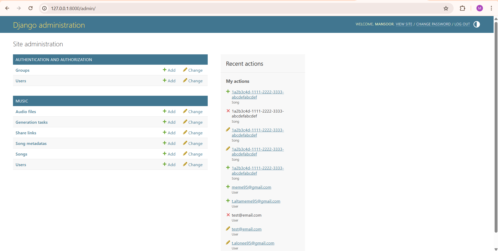

# Exercise 3 – Django Domain Layer Implementation

Repository:
https://github.com/mansoor9572/exercise3-django

## CRUD Demonstration

### Admin Dashboard

### Create User

### Read Users

### Update User

### Delete User

