# Exercise 3 – Django Domain Layer Implementation

## Project Overview
This project implements the **Domain Layer** using Django ORM based on the domain model from Exercise 2.

It demonstrates:
- Django project setup
- Domain entities implementation
- Database persistence using migrations
- CRUD operations via Django Admin
- A simple API endpointS

---

## Setup Instructions

1. Clone repository:
git clone https://github.com/mansoor9572/exercise3-django.git

2. Navigate to project:
cd exercise3-django

3. Create virtual environment:
python -m venv venv

4. Activate (PowerShell):
.\venv\Scripts\Activate.ps1

5. Install Django:
pip install django

6. Run migrations:
python manage.py migrate

7. Create admin user:
python manage.py createsuperuser

8. Run server:
python manage.py runserver

9. Open in browser:
http://127.0.0.1:8080/admin

---

### 👤 User CRUD

#### Create User
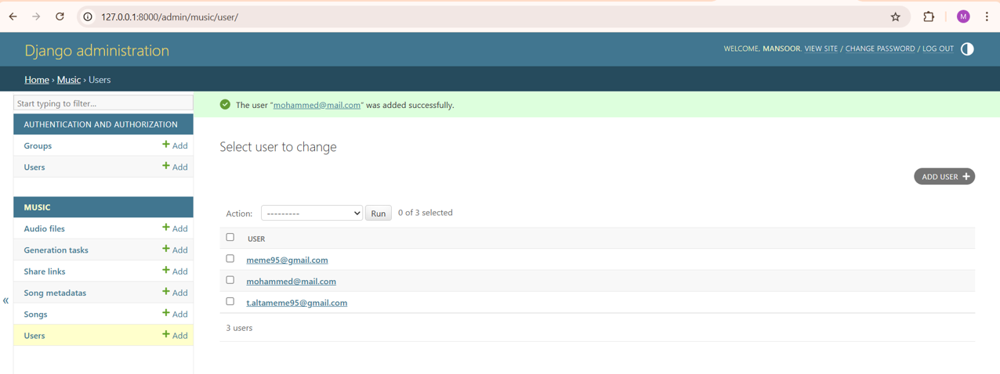

#### Read Users
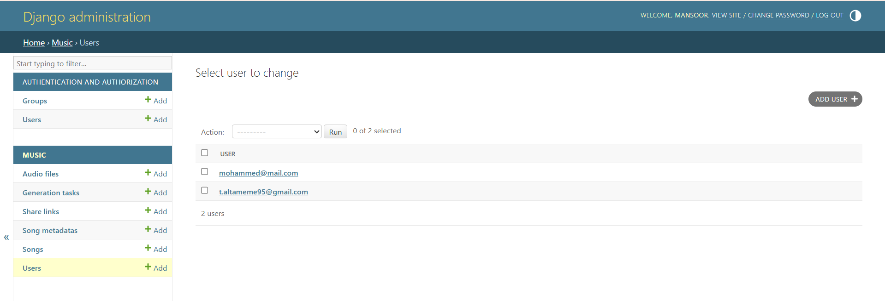

#### Update User
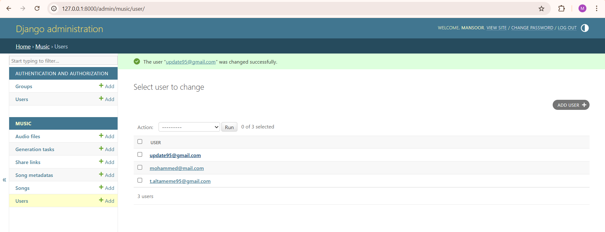

#### Delete User
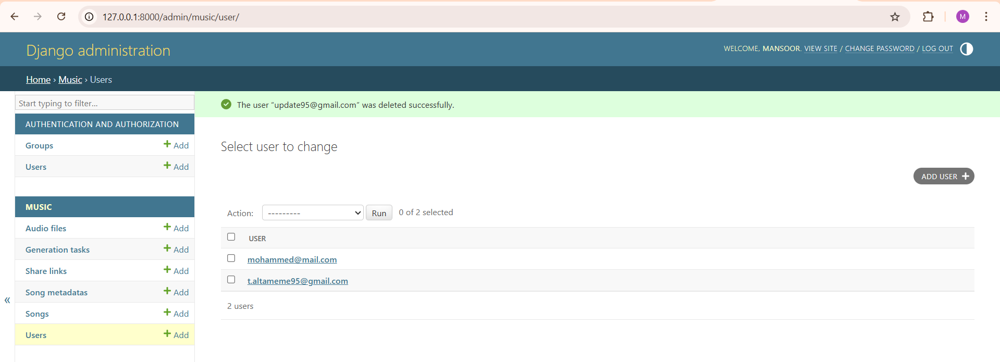

---

### 🎵 Song CRUD

#### Create Song
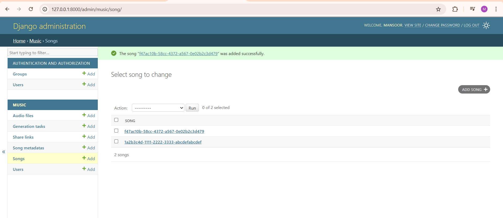

#### Read Songs
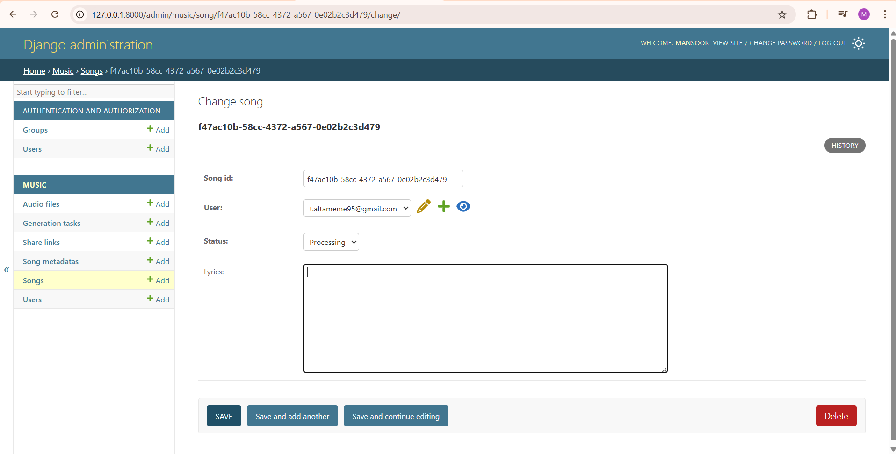

#### Update Song
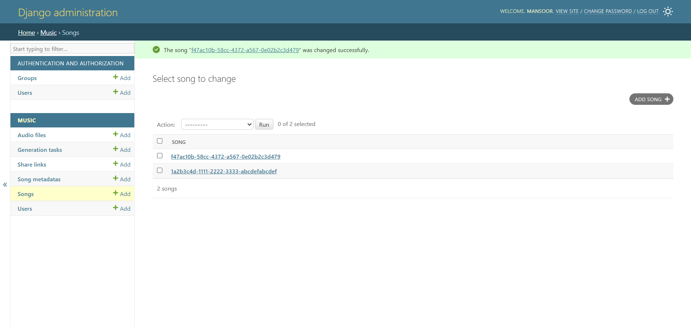

#### Delete Song
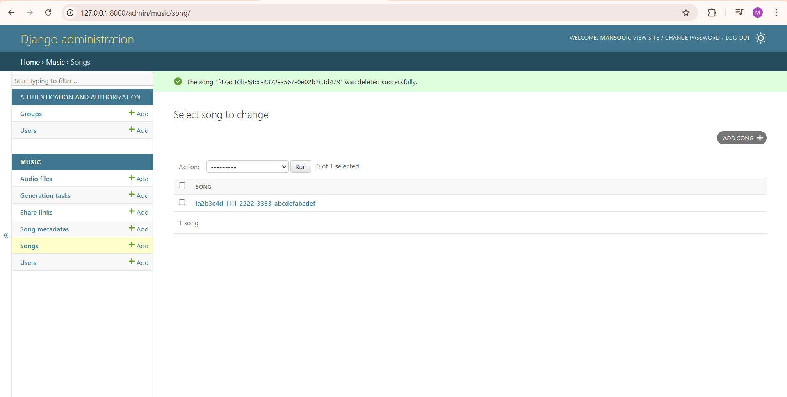


---


## API Endpoints (Django REST Framework)

- GET /songs/ → list songs
- POST /songs/ → create song
- GET /songs/{id}/ → retrieve
- PUT /songs/{id}/ → update
- DELETE /songs/{id}/ → delete

Example:
http://127.0.0.1:8000/songs/

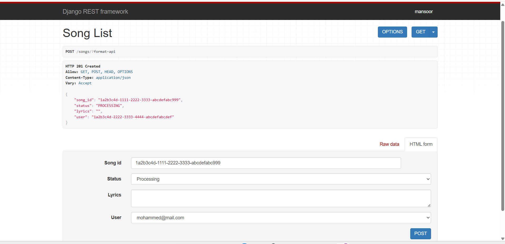

---

## Exercise 4 – Strategy Pattern (Song Generation)

### How to Run Mock Mode

```bash
python exercise_3.py mock
```

No API key needed. Returns deterministic output instantly.

### How to Run Suno Mode

1. Set your API key as an environment variable (**never commit it**):
   ```powershell
   $env:SUNO_API_KEY = "your-api-key-here"
   ```

2. Run:
   ```bash
   python exercise_3.py suno
   ```

> ⚠️ The `SUNO_API_KEY` must not be committed to the repo. Set it via environment variable or a `.env` file (`.gitignore`d).

---

### Demonstration

#### Mock Strategy Output
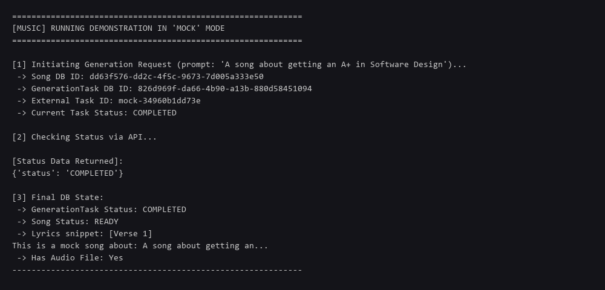

#### Suno API Strategy Output
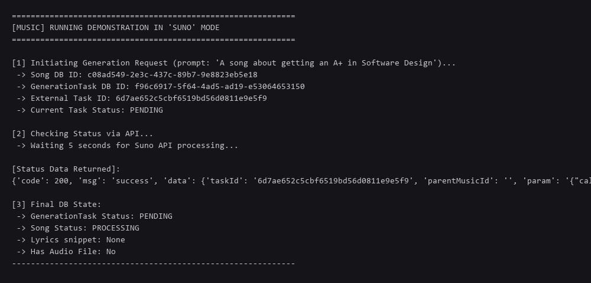

